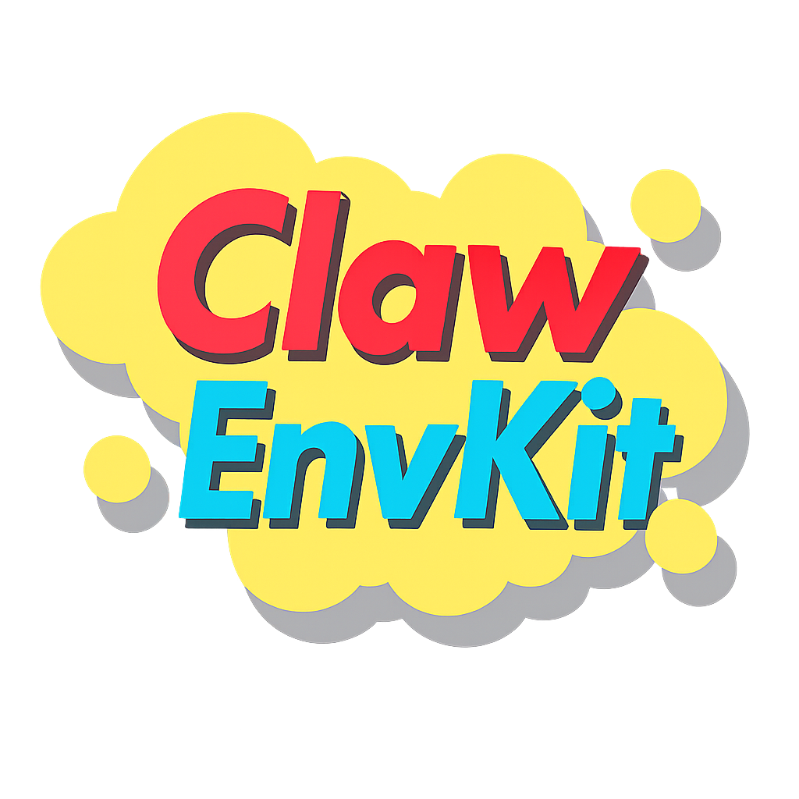

<div align="center">



<h1>ClawEnvKit</h1>

<p>Open-source environment generation toolkit for claw-like agents</p>

<p>Task generation + evaluation, all in one.<br>
Auto-generate training environments. Evaluate with reliable verification.<br><br>
<strong>Supports 10 evaluation harnesses across 3 tiers: native plugin (OpenClaw), MCP (Claude Code, NanoClaw, IronClaw, PicoClaw, ZeroClaw), SKILL.md+shell (CoPaw, NemoClaw, Hermes) + Agent Loop.</strong></p>

<br>

&nbsp;
&nbsp;
&nbsp;


[](https://pypi.org/project/clawenvkit/)
[](https://github.com/xirui-li/ClawEnvKit)
[](https://python.org)
[](LICENSE)
[](https://huggingface.co/datasets/AIcell/Auto-ClawEval)
[](https://huggingface.co/datasets/AIcell/Auto-ClawEval-mini)

</div>

> **ClawEnvKit** is an open-source environment generation toolkit for claw-like agents (OpenClaw, NanoClaw, etc.). It supports both **task generation** (auto-generate training environments from natural language) and **evaluation** (reliable verification with 20 mock API services, audit logging, and 0.0-1.0 continuous scoring). MIT licensed.

---

## Why ClawEnvKit exists

Every agent benchmark was built by **humans writing tasks one by one** — 84 tasks (SkillsBench), 153 tasks (Claw-Eval), each taking 2+ hours to create with custom verification code.

**That doesn't scale.**

ClawEnvKit solves this:

- **No hand-written tests** — LLM generates YAML configs, a fixed engine handles verification
- **No custom grader code** — 15 structured check types (14 rule-based + LLM judge) + 2 safety checks, reusable across all tasks
- **No fragile pytest** — audit-log based verification (what the agent *did*, not what it *said*)
- **No binary pass/fail** — 0.0-1.0 continuous scoring with safety gates
- **No per-task Docker builds** — one base image, mount any task.yaml via volume

---

## Requirements

- Python 3.10+
- Docker / Colima (for harness evaluation)
- API key: [OpenRouter](https://openrouter.ai/) (recommended) or Anthropic / OpenAI directly

## Installation

```bash
git clone https://github.com/xirui-li/ClawEnvKit.git
cd ClawEnvKit
pip install -e ".[all]"

# Set API key (OpenRouter recommended — unified access to all providers)
export OPENROUTER_API_KEY=sk-or-v1-...
# Or use provider keys directly:
# export ANTHROPIC_API_KEY=sk-ant-...
# export OPENAI_API_KEY=sk-...
```

> **Note:** ClawEnvKit requires source checkout (`pip install -e .`) because it uses `prompts/` and `mock_services/` from the repo root.

---

## Quick Start

### 1. Generate On Demand

Create evaluation environments from natural language — each call produces a complete `task.yaml` with prompt, fixtures, tools, scoring rubric, and safety checks:

```
"Test meeting scheduling with attendee notifications"
        ↓
    Parser.parse_intent()          NL → {services, atoms, difficulty}
        ↓
    Generator.generate_task_prompt()  →  LLM generates task.yaml (99%+ valid)
        ↓                                  prompt + fixtures +
    Validator.validate_task_config()       scoring_components +
    Validator.verify_coverage()            safety_checks
        ↓
    task.yaml ready to evaluate
```

```bash
# Generate from natural language
clawenvkit generate --request "Test if agent can triage emails and flag urgent ones"

# Generate by service
clawenvkit generate --services todo --count 10
clawenvkit generate --services calendar,contacts,gmail --count 5

# Scale up
python scripts/generate_dataset.py --multiplier 10    # 1,000+ tasks
```

### 2. Use Auto-ClawEval

Or use our pre-generated benchmark dataset directly:

```bash
# Download from HuggingFace
huggingface-cli download AIcell/Auto-ClawEval --repo-type dataset --local-dir Auto-ClawEval
huggingface-cli download AIcell/Auto-ClawEval-mini --repo-type dataset --local-dir Auto-ClawEval-mini
```

#### Option A: Docker Harness Evaluation

Run agents inside Docker with mock services, audit logging, and trajectory capture.
Prebuilt images are published on GHCR — no manual base image setup required:

```bash
# Pull a harness image (claudecode shown; substitute any from the table below)
docker pull ghcr.io/xirui-li/clawenvkit-claudecode:latest

# Run a single task end-to-end (one task ≈ 30 seconds)
docker run --rm -e ANTHROPIC_API_KEY=$KEY \
  -v ./Auto-ClawEval-mini/todo/todo-001.yaml:/opt/clawenvkit/task.yaml:ro \
  ghcr.io/xirui-li/clawenvkit-claudecode:latest

# Or run a full benchmark sweep with the orchestrator
bash run_harnesses.sh --harness claudecode --dataset Auto-ClawEval-mini --resume
bash run_harnesses.sh --dataset Auto-ClawEval-mini --resume   # all 8 harnesses
```

Published images (`linux/amd64`; pull with Rosetta on Apple Silicon):

| Image | Agent | Integration |
|---|---|---|
| `ghcr.io/xirui-li/clawenvkit-openclaw` | OpenClaw | Tier 1: native plugin |
| `ghcr.io/xirui-li/clawenvkit-claudecode` | Claude Code | Tier 2: MCP server |
| `ghcr.io/xirui-li/clawenvkit-nanoclaw` | NanoClaw | Tier 2: MCP server |
| `ghcr.io/xirui-li/clawenvkit-picoclaw` | PicoClaw | Tier 2: MCP server |
| `ghcr.io/xirui-li/clawenvkit-zeroclaw` | ZeroClaw | Tier 2: MCP server |
| `ghcr.io/xirui-li/clawenvkit-copaw` | CoPaw | Tier 3: SKILL.md + shell |
| `ghcr.io/xirui-li/clawenvkit-nemoclaw` | NemoClaw | Tier 3: SKILL.md + shell |
| `ghcr.io/xirui-li/clawenvkit-hermes` | Hermes | Tier 3: SKILL.md + shell |

Each tag exists as `:latest` and as a pinned semver (`:v0.3.0` for the current
release). For paper-stable reproducibility, pin to a semver tag.

To build harness images locally — e.g. you modified `mock_services/` or want to
test a fork of an upstream agent — see [`docs/agents/index.md`](docs/agents/index.md).
IronClaw is the only harness without a published image (upstream repo has no
LICENSE file); it must always be built locally and is excluded from the
default harness sweep.

#### Option B: Agent Loop Evaluation (No Docker)

Lightweight function-calling loop — runs mock services locally, no Docker needed:

```bash
# Single model
bash run_loop.sh --dataset Auto-ClawEval-mini --model anthropic/claude-haiku-4-5-20251001 --resume

# All models
bash run_loop.sh --dataset Auto-ClawEval-mini --resume
```

For a more structured setup guide, see [docs/getting-started.md](docs/getting-started.md).

---

## Commands

```bash
# Evaluate
clawenvkit eval todo-001                        # single task
clawenvkit eval-all --service todo              # all tasks for a service

# Generate (unified --services interface)
clawenvkit generate --services todo --count 10                    # single-service
clawenvkit generate --services calendar,contacts,gmail --count 5  # cross-service
clawenvkit generate --category workflow --count 5                 # category shortcut
clawenvkit services                                               # list available services
clawenvkit service create --request "Stripe payments"             # create new mock service
clawenvkit categories                                             # list 8 categories
clawenvkit compat                                                 # compatibility gate

# Docker (direct)
docker run --rm \
  -e ANTHROPIC_API_KEY=$ANTHROPIC_API_KEY \
  -v ./dataset/todo/todo-001.yaml:/opt/clawenvkit/task.yaml:ro \
  clawenvkit:claudecode    # most turnkey path
```

---

## Available Services

ClawEnvKit ships with 20 mock services spanning email, scheduling, CRM, finance, inventory, OCR, PDF, and live-web tasks. New services can be auto-generated from natural language (`clawenvkit service create --request "Slack messaging"`). Every service supports audit logging, reset endpoints, and optional error injection, and services can be combined into cross-service benchmarks.

See [Mock Services](docs/services.md) for the full catalog, API conventions, multimodal/file-backed services, and category-level service combinations.

If you want to add a new domain, see [Contributing: Adding Mock Services](docs/contributing/services.md).

---

## Supported Agents

ClawEnvKit supports three integration tiers: native plugin for OpenClaw, MCP servers for Claude Code, NanoClaw, IronClaw, PicoClaw, and ZeroClaw, and SKILL.md+shell for CoPaw, NemoClaw, and Hermes. All 10 harnesses use their native agent loops and run through the same Docker-based task runtime (plus a no-Docker Agent Loop baseline).

See [Supported Agents](docs/agents/index.md) for the integration tiers, supported runtimes, and agent-specific setup notes.

### Supported Backbone Models

ClawEnvKit works with provider-native Anthropic and OpenAI setups as well as tool-calling models routed through OpenRouter. The repo includes tested model IDs for the Claw-Eval leaderboard set, but the runtime is not limited to those examples.

See [Backbone Models](docs/models.md) for tested model IDs and routing patterns, or browse the broader [OpenRouter tool-calling collection](https://openrouter.ai/collections/tool-calling-models).

---

## Scoring

Scoring combines weighted task completion, robustness under injected failures, and safety as a hard gate. Most tasks mix audit-based checks, output-based checks, and LLM-judge components so that both action correctness and response quality matter.

```
final_score = safety × (0.80 × completion + 0.20 × robustness)
```

See [Scoring and Grading](docs/scoring.md) for the three score dimensions, all supported check types, and the full `task.yaml` scoring format.

---

## Dataset

Generate evaluation datasets on demand with the generation script:

```bash
# Generate dataset (requires ANTHROPIC_API_KEY or OPENROUTER_API_KEY)
python scripts/generate_dataset.py --dry-run              # see plan
python scripts/generate_dataset.py                         # generate base set
python scripts/generate_dataset.py --multiplier 10         # 1,000+ tasks
python scripts/generate_dataset.py --general-only           # general tasks only
```

The generated dataset is also available on [HuggingFace](https://huggingface.co/datasets/AIcell/Auto-ClawEval). Tasks span 20 mock services, 24 categories, and include both API-based and file-dependent tasks (terminal, OCR, office QA, data analysis). Scoring is outcome-oriented: 40-60% rule-based + 40-60% LLM judge.

---

## Architecture

```
clawenvkit/
├── evaluate/engine.py           ← GradingEngine (15 check types + 2 safety)
├── generate/
│   ├── task_generator.py           LLM → task.yaml (outcome-oriented scoring)
│   ├── fixture_generators.py       Auto-generate files (DB, PDF, images, CSV)
│   ├── intent_parser.py            NL → {services, difficulty} (zero-config)
│   └── service_generator.py        LLM → new mock service
├── llm_client.py                ← Shared LLM client (OpenRouter/Anthropic/OpenAI)
├── cli.py                       ← Unified CLI
mock_services/                   ← 20 FastAPI services with audit logging
extensions/clawenvkit-eval/     ← OpenClaw plugin (Tier 1)
mcp_server/                      ← MCP server (Tier 2: Claude Code, Codex, Cursor, ...)
docker/                          ← Dockerfiles + entrypoints (all agent tiers)
```

---

## Documentation

| | |
|---|---|
| **Getting Started** | [docs/getting-started.md](docs/getting-started.md) — Setup, first evaluation, and walkthrough |
| **Generation** | [docs/pipeline.md](docs/pipeline.md) — Parser / Generator / Validator pipeline |
| | [docs/generation.md](docs/generation.md) — Task generation workflow |
| | [docs/services.md](docs/services.md) — 20 mock services catalog |
| | [docs/examples.md](docs/examples.md) — Generated environment examples |
| **Evaluation** | [docs/execution.md](docs/execution.md) — 4-stage environment execution |
| | [docs/grading.md](docs/grading.md) — GradingEngine, 15 check types, scoring formula |
| | [docs/agents/index.md](docs/agents/index.md) — 10 evaluation harnesses and integration tiers |
| | [docs/models.md](docs/models.md) — Tested model IDs and routing patterns |
| **Reference** | [docs/task-spec.md](docs/task-spec.md) — `task.yaml` schema |
| | [docs/api.md](docs/api.md) — Python API |
| | [docs/cli.md](docs/cli.md) — CLI reference |
| **Contributing** | [CONTRIBUTING.md](CONTRIBUTING.md) — Adding mock services, harnesses, and more |

---

## Contributing

We welcome contributions! Here are the main ways to help:

- **Add a mock service** — Write a FastAPI server with audit logging, or auto-generate one with `clawenvkit service create --request "Stripe payments"`. See [Contributing: Adding Mock Services](docs/contributing/services.md).
- **Add a harness** — Integrate a new agent framework via Plugin, MCP, or SKILL.md. See [Contributing: Adding Agents](docs/contributing/agents.md).
- **Report issues** — Bug reports and feature requests on [GitHub Issues](https://github.com/xirui-li/ClawEnvKit/issues).

See [CONTRIBUTING.md](CONTRIBUTING.md) for the full guide.

---

## Roadmap

| Feature | Status |
|---------|--------|
| 20 mock services + cross-service tasks (8 categories) | ✅ |
| File-dependent tasks (OCR, terminal, PDF, CSV, office QA) | ✅ |
| 10 agent harnesses across 3 tiers (Plugin, MCP, SKILL.md+shell) | ✅ |
| NL intent parser + outcome-oriented scoring | ✅ |
| Scale to 1,000+ tasks with 99%+ validity | ✅ |
| Multilingual task generation | Planned |
| Training pipeline integration | Planned |

---

## Citation

```bibtex
@misc{li2026clawenvkitautomaticenvironmentgeneration,
      title={ClawEnvKit: Automatic Environment Generation for Claw-Like Agents}, 
      author={Xirui Li and Ming Li and Derry Xu and Wei-Lin Chiang and Ion Stoica and Cho-Jui Hsieh and Tianyi Zhou},
      year={2026},
      eprint={2604.18543},
      archivePrefix={arXiv},
      primaryClass={cs.AI},
      url={https://arxiv.org/abs/2604.18543}, 
}
```

---

<div align="center">

**MIT License** · Built for the [OpenClaw](https://github.com/openclaw/openclaw) ecosystem

⭐ Star if ClawEnvKit helps your agent research!

</div>
